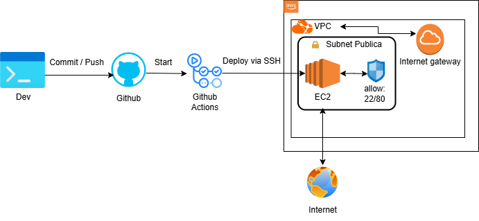

# DevOps Challenge - AWS Infra + CI/CD

> This is a challenge by [Coodesh](https://coodesh.com/)

## 📝 Descrição
Este projeto tem como objetivo provisionar uma infraestrutura segura na AWS utilizando Terraform (100% IaC), implantar uma instância EC2 com NGINX para servir uma página estática (`index.html`) e automatizar o deploy contínuo via GitHub Actions.

## 🚀 Tecnologias e Ferramentas Utilizadas
- **Terraform** (Infraestrutura como Código)
- **AWS EC2, VPC, Subnet, Security Group, Internet Gateway, Route Table**
- **NGINX** (servidor web)
- **GitHub Actions** (CI/CD)
- **Ubuntu Server 22.04 LTS** (Free Tier)
- **SSH** (acesso remoto e deploy)

## 📁 Estrutura do Projeto
```
.
├── .github/workflows/deploy.yaml   # Pipeline de CI/CD
├── site/index.html                 # Página estática
├── main.tf                         # Definição da infraestrutura principal
├── variables.tf                    # Variáveis do projeto
└── README.md                       # Este arquivo
```

## 🏗️ Infraestrutura Provisionada
Usando Terraform, são criados:
- Uma **VPC** com suporte a DNS
- Uma **sub-rede pública** na AZ `us-east-1a`
- Um **Internet Gateway** e tabela de rotas
- Um **Security Group** com acesso liberado para HTTP (80) e SSH (22)
- Uma instância **EC2 t2.micro (Free Tier)** com Ubuntu 22.04
- Instalação automatizada do **NGINX** via `user_data`

## 🔐 Segurança
- Apenas portas 22 e 80 abertas para acesso público
- Autenticação por chave SSH (sem uso de usuário root ou acesso por senha)
- Recomendação de uso de `EC2 Instance Connect` ou usuários IAM para produção

## 🔄 CI/CD com GitHub Actions
Uma pipeline foi configurada para:
1. Detectar mudanças no diretório `site/`
2. Conectar via SSH na EC2
3. Substituir o conteúdo do `/var/www/html/index.html`
4. Reiniciar o NGINX

## 📊 Monitoramento

A instância EC2 utiliza integração com o **Amazon CloudWatch** para monitoramento de métricas básicas (CPU, disco, rede). Além disso:

- Logs do NGINX estão disponíveis em `/var/log/nginx/`
- Pode-se configurar facilmente envio de logs para o CloudWatch Logs (fora do escopo deste desafio, mas recomendado em produção)
- Para uma abordagem mais completa, ferramentas como **Prometheus + Node Exporter** podem ser adicionadas, mas foram evitadas aqui para manter o ambiente leve e dentro do Free Tier.

## 💾 Backup (sem custo)
A estratégia de backup recomendada é baseada em **snapshots manuais do volume EBS** da EC2:
- Snapshots podem ser criados via Console ou CLI
- Também é possível automatizar via **AWS Data Lifecycle Manager** sem custo adicional


### Exemplo de pipeline (`.github/workflows/deploy.yaml`)
```yaml
name: Deploy Hello World

on:
  push:
    paths:
      - 'site/**'
    branches:
      - main

jobs:
  deploy:
    runs-on: ubuntu-latest
    steps:
    - name: Checkout repo
      uses: actions/checkout@v3

    - name: Set up SSH key
      uses: webfactory/ssh-agent@v0.7.0
      with:
        ssh-private-key: ${{ secrets.SSH_PRIVATE_KEY }}

    - name: Deploy HTML to EC2
      run: |
        scp -o StrictHostKeyChecking=no site/index.html ubuntu@${{ secrets.EC2_PUBLIC_IP }}:/tmp/index.html
        ssh -o StrictHostKeyChecking=no ubuntu@${{ secrets.EC2_PUBLIC_IP }} "sudo mv /tmp/index.html /var/www/html/index.html && sudo systemctl restart nginx"
```

## 📡 Diagrama da Solução



> O código-fonte HTML e a infraestrutura são separados. A pipeline detecta alterações no HTML e realiza o deploy na EC2 provisionada.

## 🛠️ Como rodar o projeto localmente
### Pré-requisitos
- Conta AWS com par de chaves SSH criado previamente
- Terraform >= 1.3
- GitHub repo com secrets:
  - `EC2_PUBLIC_IP`: IP público da EC2
  - `SSH_PRIVATE_KEY`: chave privada da instância EC2

### Passos
```bash
# Clone o repositório
$ git clone https://github.com/seu-usuario/devops-challenge.git
$ cd devops-challenge

# Configure a chave SSH no Terraform (key_name no variables.tf)

# Inicialize o Terraform
$ terraform init

# Validar as alterações na a infraestrutura
$ terraform validate

# Visualizar as alterações na a infraestrutura
$ terraform plan

# Formatar os manifestos
$ terraform fmt

# Aplique a infraestrutura
$ terraform apply

# Acesse a EC2 com a chave criada
$ ssh -i chave.pem ubuntu@<EC2_PUBLIC_IP>

# Acesse no navegador
# Não foi configurar um certificado digital, uma alternativa free seria utilizar o let's encrypt
http://54.205.79.109/
```

---

## ✅ Checklist de entrega
- [x] Infraestrutura criada com Terraform ✅
- [x] Servidor seguro com NGINX ✅
- [x] Deploy automático via GitHub Actions ✅
- [x] Página servida via HTTP ✅
- [x] README completo ✅

## 📌 Considerações finais
Não utilizei docker e criei um container porque o enunciado fala sobre instalar e configurar softwares no servidor, como NGINX, sob perspectivas de segurança, performance e monitoramento.

---

## 📬 Suporte
Para dúvidas sobre o processo, entre em contato com o suporte da Coodesh pela plataforma.

---
**This is a challenge by [Coodesh](https://coodesh.com/)**